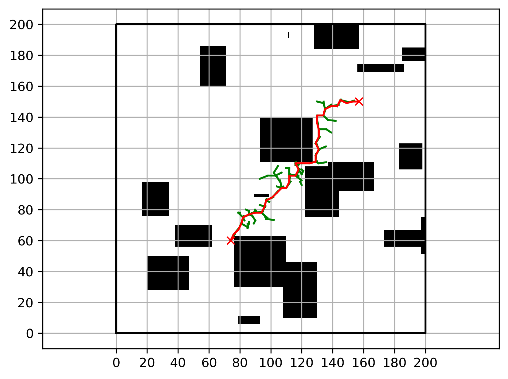
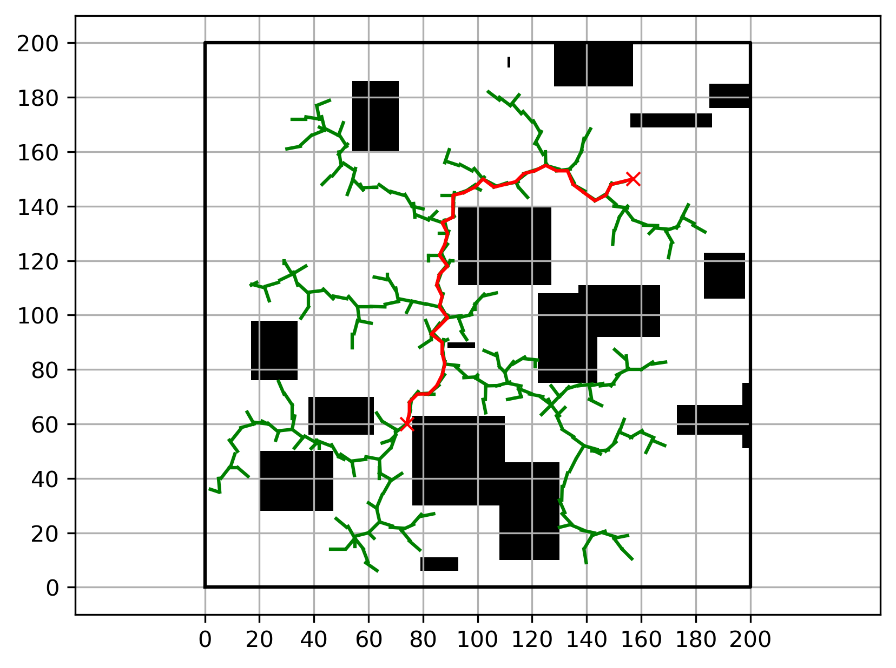

# GN-RRT

Training code is adapted from my repo [Torch-MTS](https://github.com/XDZhelheim/Torch-MTS).

GN-RRT vs. RRT:
 | 
---|---

## Instruction

1. `a_star_gen_images.py`

    generate `n` images, and `p` (start, end) pairs for each image.

    in total `n*p` image samples.

    default image shape: 200\*200

2. `gen_dataset.py`

    generate train, validation and test datasets for given `n` and `p`.

    specify `num_grids_height` and `num_grids_width` in this file.

    default: 20\*20 grids, each grid is of 10\*10 shape

3. `train.py`

    train the model.
    ```bash
    python train.py -m gridgcn -n 500 -p 20 -g <your_gpu_id>
    ```

4. `grid_rrt.py`

    run NaiveRRT or GridNeuralRRT.

    see this file for details.

## Results

- `n=20, p=10, 200 images, max_iter=400`
    ```
    ----- Grid Neural RRT -----
    Avg time: 0.04270470976829529
    Avg iters: 146.445
    Success rate: 0.92

    ----- Naive RRT -----
    Avg time: 0.08481519579887391
    Avg iters: 272.04
    Success rate: 0.66
    ```
- `n=100, p=10, 1000 images, max_iter=400`
    ```
    ----- Grid Neural RRT -----
    Avg time: 0.03659790062904358
    Avg iters: 141.838
    Success rate: 0.894

    ----- Naive RRT -----
    Avg time: 0.08226466464996338
    Avg iters: 272.459
    Success rate: 0.629
    ```

- `n=300, p=20, 6000 images, max_iter=400`
    ```
    ----- Grid Neural RRT -----
    Avg time: 0.0367194459438324
    Avg iters: 138.48533333333333
    Success rate: 0.9016666666666666

    ----- Naive RRT -----
    Avg time: 0.07920803066094717
    Avg iters: 264.891
    Success rate: 0.6476666666666666
    ```

注意数据的坐标系
- 在array和tensor中左上角是 (0, 0), 向下是第一维 (height维) 正方向, 向右是第二维 (weight维) 正方向
- 在画图的时候左下角是 (0, 0), 第一维画成了横轴, 向右是第一维正方向
- 实际上存数据的时候是一样的，只不过画图的时候把原点定在了左下角，所以一张图存的 (height, width) 但是画出来是 (width, height)
- 在做数据集的时候容易混乱, 然而就按 (H, W) 来就行, 不需要什么坐标转换; 不要惦记着画图是怎么画的, 容易把自己搞晕
